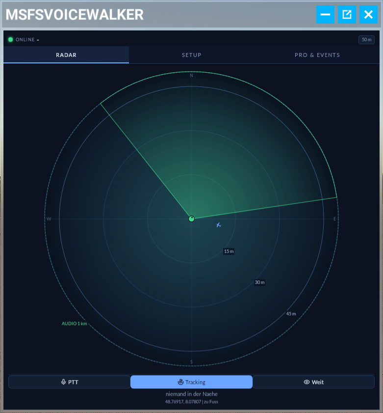
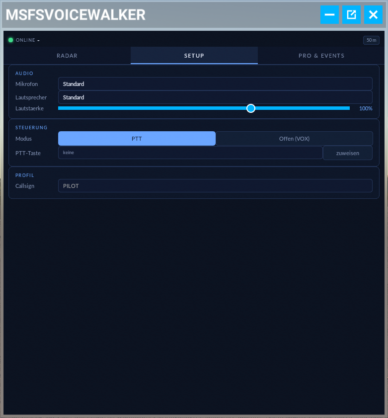
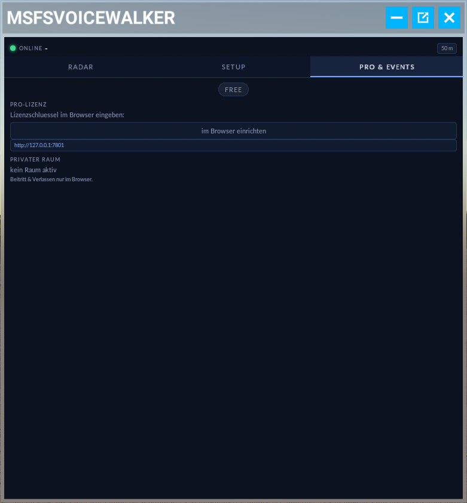
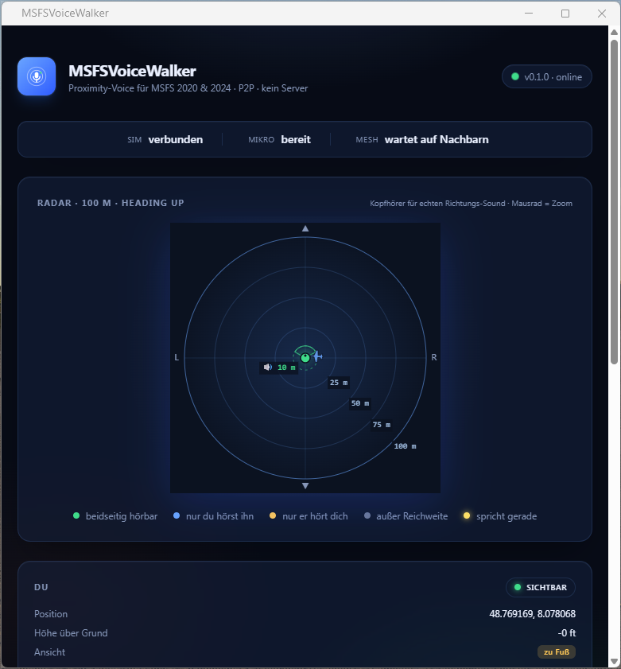
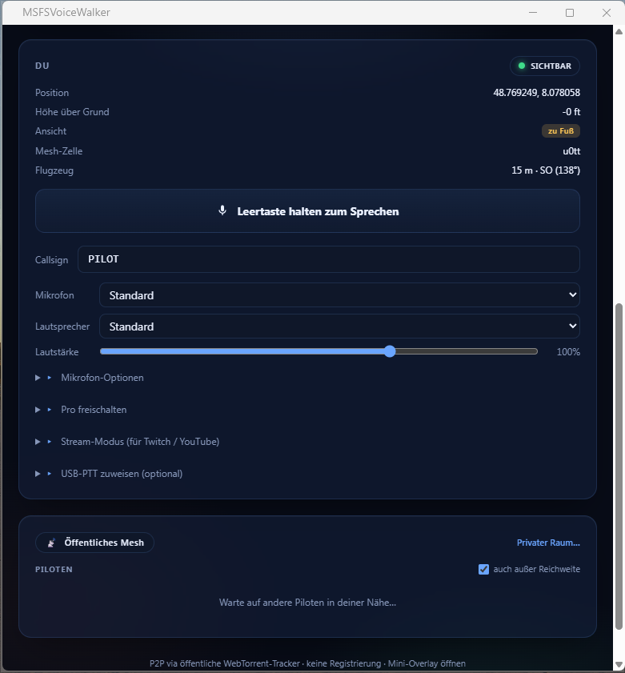

# MSFSVoiceWalker — Press Kit

  

**Proximity-Voice für Microsoft Flight Simulator — Peer-to-Peer, ohne Server, ohne Registrierung.**

Du hörst andere Piloten genau dann, wenn ihr euch in der Sim wirklich nahe seid. Die Lautstärke fällt mit der Distanz, das Audio ist 3D-positioniert (Kopfhörer empfohlen), und niemand zwischen euch — kein zentraler Voice-Server, kein Account, keine Datenkrake. Trystero / WebTorrent-Tracker ersetzen den Server.

Zwei Modi je nach Spielsituation: **direktes Sprechen** wenn du als Walker auf dem Vorfeld stehst (so wie wenn ihr nebeneinander steht), und **Funk-Style** im Cockpit (rundum hörbar, klassische Pilot-Pilot-Funkverbindung).

---

## 🟢 Aktueller Status: Open Beta

Die App läuft, ist installierbar, und sucht jetzt **echte Tester** für das Finetuning. Du musst nicht programmieren können — nur fliegen, Bugs melden, Eindrücke teilen.

### Was ich von Testern brauche
- **MSFS 2024** installiert (Pflicht — 2020 wird parallel unterstützt, aber im Beta-Fokus liegt 2024)
- **Etwas Zeit** für ein paar Test-Flüge in einem privaten Raum oder im öffentlichen Mesh
- **Discord-Account** für kurzen Austausch (Bug-Reports, Feedback, „klingt das natürlich?")

### So mitmachen
**Discord:** [https://discord.gg/QWmbSycE](https://discord.gg/QWmbSycE)
Schreib mich dort kurz an, ich schalte dich frei und gebe dir die Beta-Installer + eine kurze Anleitung.

---

## Was ist MSFSVoiceWalker?

Ein Add-on für MSFS, das aus Sim-Position + Heading echte räumliche Sprachkommunikation macht — angepasst an die Situation, in der du gerade bist. Drei Komponenten arbeiten zusammen:

1. **System-Tray-App** (Windows) — läuft im Hintergrund, redet mit MSFS via SimConnect
2. **Browser-UI** (Edge `--app`-Window) — Setup, Mikro, Lautstärke, Pro-Lizenz
3. **MSFS InGame-Panel** — Toolbar-Panel für den Live-Betrieb mit Radar, PTT, Tracking, Setup

## Die zwei Modi

Der Modus wechselt automatisch je nach Situation in MSFS — du musst nichts umschalten.

### 🚶 Walker-Modus — direktes Sprechen
Wenn du in MSFS aus dem Flugzeug aussteigst und zu Fuß auf dem Vorfeld bist: andere hören dich **nur wenn sie nahe genug sind UND du in ihre Richtung sprichst** (120°-Hörkegel nach vorne, wie im echten Leben). Genau wie wenn ihr nebeneinander am Hangar stehen würdet — kein Funk, einfach normales Reden.

### ✈️ Cockpit-Modus — Funk-Style
Sobald du wieder im Flugzeug sitzt: **rundum hörbar** auf Distanz, klassische Pilot-Pilot-Funkverbindung. Andere Piloten in Reichweite hören dich aus jeder Richtung — wie ein echtes Cockpit-Funkgerät.

## Features

| | |
|---|---|
| **Distanz-basierte Lautstärke** | Je näher, desto lauter — sanftes Ein- und Ausblenden |
| **3D-Audio (HRTF)** | Stimmen kommen aus der echten Richtung — Kopfhörer für vollen Effekt |
| **Automatischer Modus-Wechsel** | Walker beim Aussteigen, Cockpit-Funk beim Einsteigen — ohne Knopfdruck |
| **Push-to-Talk oder VOX** | Wahlweise Tasten-Halten oder automatische Sprach-Erkennung |
| **PTT-Bind** | Tastatur oder Joystick-Button — auch USB-PTT-Hardware |
| **Privater Raum** | Mit deiner Crew einen geschlossenen Raum aufmachen — andere hören dich nicht |
| **Live-Radar** | Im InGame-Panel UND im Browser — siehst wer in Hörweite ist |
| **P2P, kein Server** | Trystero über öffentliche WebTorrent-Tracker — keine Anmeldung, keine Daten |
| **Kostenlos (Free + Pro)** | Free für alles Wesentliche; Pro für erweiterte Features |

## Screenshots

### MSFS InGame-Panel
Direkt in der MSFS-Toolbar — Radar mit Audio-Cone, PTT-Button, Tracking-Toggle.

### Setup-Tab im Panel
Mikro, Lautsprecher, Lautstärke, PTT/VOX-Modus, Callsign — direkt in MSFS, ohne Alt-Tab.

### Pro & Events Tab
Lizenz-Eingabe, Privater Raum, Event-Hinweise.

### Browser-UI (Hauptansicht)
Großes Radar mit Walker-Hörkegel, Range-Ringen, Status-Strip (Sim/Mikro/Mesh).

### Browser-UI (Steuerung & Mesh)
PTT-Button, Mikrofon-Optionen, Stream-Modus für Twitch/YouTube, USB-PTT-Bind.

## System-Voraussetzungen

- **Windows 10/11**
- **MSFS 2024** (Steam oder MS Store) — 2020 läuft parallel, aber im Beta-Fokus liegt 2024
- **Microsoft Edge** (für die Edge-`--app`-Browser-UI; auf Windows ohnehin vorinstalliert)
- **Mikrofon + Kopfhörer** (für 3D-Audio empfohlen — Lautsprecher gehen, aber HRTF wirkt schwächer)

## Brand Assets

| | |
|---|---|
| App-Icon | [`brand/app-icon.svg`](../brand/app-icon.svg) |
| Logo (mit Text, vertikal) | [`brand/voicewalker-logo.png`](../brand/voicewalker-logo.png) |
| Logo (mit Text, horizontal) | [`brand/voicewalker-logo-horizontal.png`](../brand/voicewalker-logo-horizontal.png) |
| Logo (nur Mark, ohne Text) | [`brand/voicewalker-logo-mark.png`](../brand/voicewalker-logo-mark.png) |
| Map-Icon | [`brand/Map-icon.svg`](../brand/Map-icon.svg) |

Alle SVG, frei für Berichterstattung im Beta-Kontext nutzbar.

## Kontakt & Beta-Anmeldung

**Discord (primär):** [https://discord.gg/QWmbSycE](https://discord.gg/QWmbSycE)
Im Server gibt es einen `#beta`-Channel und einen direkten Draht zu mir für Bug-Reports und Feedback-Runden.

---

MSFSVoiceWalker · Open Beta · v0.1.0 · Stand: April 2026
